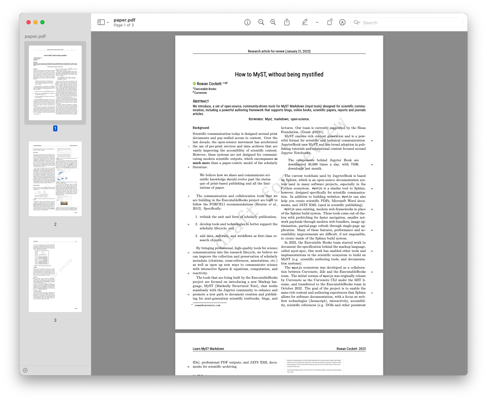

# Latest Blog Posts

<!-- # MyST Quickstart

This repository contains the files used in the [quickstart guide](https://mystmd.org/guide/quickstart), and can be used to follow that guide, before trying MyST with your own content.

> **Note** This is **not** a good example of an actual MyST project! The repositories purpose is to be a simple markdown + notebook repository that can be transformed throughout a tutorial.

The goals of the [quickstart guide](https://myst.tools/docs/mystjs/quickstart) are:

1. Create a `myst` site, using the standard template
2. Improve the frontmatter, to add authors, affiliations and other metadata
3. Export the paper as a PDF, Word document, and LaTeX files
4. Integrate a Jupyter Notebook output into our paper, to improve reproducibility
5. Publish a website of with our work 🚀

## Improving Frontmatter and MyST Site

## Export as a PDF

 -->

## 2025

  

    <a href="https://example.com/summit" style="text-decoration: none; color: #1a0dab;">
      <strong>Jupyter Book at the Scientific Python 2025 Developer Summit</strong>
    </a>
    
How the team took advantage of being co-located and working closely with Scientific Python developers.

    
<strong>Date:</strong> 2025-05-23

  

  

    <a href="https://example.com/jupyterhub-cafe" style="text-decoration: none; color: #1a0dab;">
      <strong>Join the Jupyter Book team at a JupyterHub Collaboration Cafe</strong>
    </a>
    
The JupyterHub team have graciously opened their space to the Jupyter Book community.

    
<strong>Date:</strong> 2025-04-09

  

  

    <a href="https://example.com/turing-upgrades" style="text-decoration: none; color: #1a0dab;">
      <strong>The Turing Way upgrades to Jupyter Book 2</strong>
    </a>
    
What we liked and learned, and what we’d like to see improved

    
<strong>Date:</strong> 2025-02-27

  

<!-- # Recent blog posts 2 -->

##

## 2024
